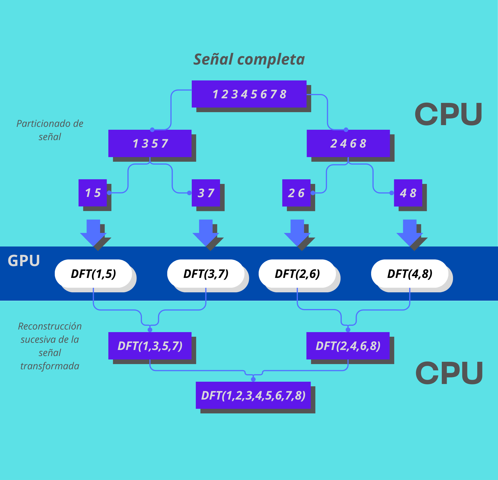

## Transformada rapida de Fourier en C
La implementación esta basada en el algoritmo de **Cooley–Tukey FFT**, el proposito de esta implementacion es el uso de la GPU para la realizacion de calculos, el algoritmo divide la señal en los terminos pares y impares, de modo que la señal resultante es de la mitad de tamaño, esto se repite con cada una de las señales resultantes hasta tener una señal que consté de dos datos.

## **Instalación**

Primero hay que copiar el repositorio y acceder a la carpeta

    git clone https://github.com/EleSoyEle/FFT
Posteriormente hay que compilar el archivo cscript.c

    gcc -o program cscript.c -lm -lOpenCL
Se usa `-lm` y `-lOpenCL` para que el compilador sepa que usa la liberia math.h y la libreria de OpenCL .

Hay que asegurarse de que los archivos data.txt y out.txt esten ya hechos,en data debe estar la señal de entrada pegada sin espacios en blanco, se aceptan numeros complejos(para quienes buscan calcular la transformada inversa), deben seguir el formato: "a+bi" sin espacios ni nada.
Ejemplo de los formatos validos para el archivo data.txt

    
    1.3
    2.0
    3
    10.3+4i
    1e-4-3i

Y ya nada mas queda correr el archivo.

    ./program

## **Posibles errores**
Dado que se usa openCL debe tenerse instalada la libreria de OpenCL en C para poder ejecutar el programa satisfactoriamente.

En algunos dispositivos pueden haber problemas para escribir el archivo de salida, depende del OS en que se esté ejecutando.
